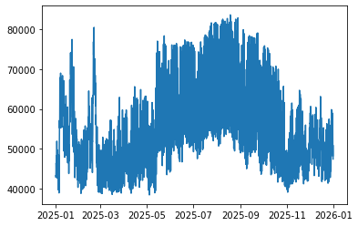
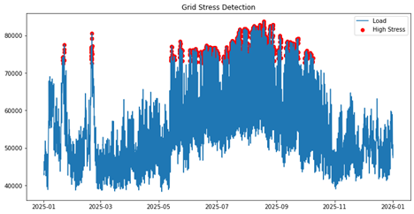
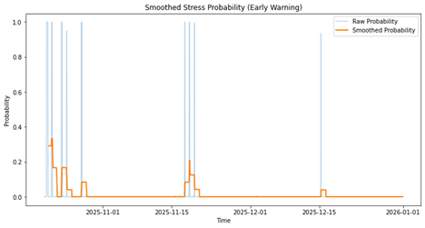

# Electricity Market Data Analysis & Grid Stress Prediction System

## Overview
This project analyzes ERCOT electricity load data to understand system behavior, model price response, and detect high-stress grid conditions using Python and machine learning.

It demonstrates how transmission system conditions and electricity market behavior can be analyzed using data-driven methods.

---

## Project Highlights
- Processed real ERCOT electricity load data
- Built Python data pipelines for time-series analysis
- Modeled electricity price behavior based on demand
- Developed machine learning model (Random Forest) for grid stress detection
- Implemented early warning system using probability smoothing
- Applied PowerWorld simulation to understand transmission system constraints and congestion

---

## Objectives
- Analyze ERCOT load behavior over time
- Clean and structure real-world time-series grid data
- Model relationship between system load and electricity price behavior
- Detect high-stress grid conditions using machine learning
- Build a probabilistic early warning indicator for grid stress
- Connect market behavior with transmission system concepts

## Tools Used
- Python
- Pandas
- NumPy
- Matplotlib
- Scikit-learn
- Jupyter Notebook
- SQL concepts
- PowerWorld Simulator

## Key Features
- ERCOT load data cleaning and preprocessing
- Timestamp correction and numeric data formatting
- Load profile and seasonal demand analysis
- Market-inspired price modeling
- Forecasting model for price behavior
- Random Forest classification for stress detection
- Probability-based early warning signal
- PowerWorld-based transmission system interpretation

## Project Workflow
1. Load ERCOT electricity demand data
2. Clean timestamp and numeric formatting issues
3. Analyze system load patterns
4. Build a price model based on demand behavior
5. Define high-stress grid conditions
6. Train a machine learning model to classify stress events
7. Generate probability-based early warning signals
8. Interpret results from a transmission and electricity market perspective

## Results
The system identified high-load and high-price conditions as potential stress events.  
The machine learning model improved after addressing class imbalance and adding key features.  
Smoothed probability outputs were used to create an early warning signal for increasing grid stress risk.

### Load Behavior

### Stress Detection

### Early Warning System

## Relevance to Transmission Analysis
This project supports understanding of:
- Wholesale electricity price formation
- Transmission system stress
- Load-driven market behavior
- Data quality and validation
- Forecasting input preparation
- Automated market data analysis workflows

## Disclaimer
This project uses ERCOT load data and a simplified price model for educational and portfolio purposes. It is not intended for operational market forecasting or trading decisions.
